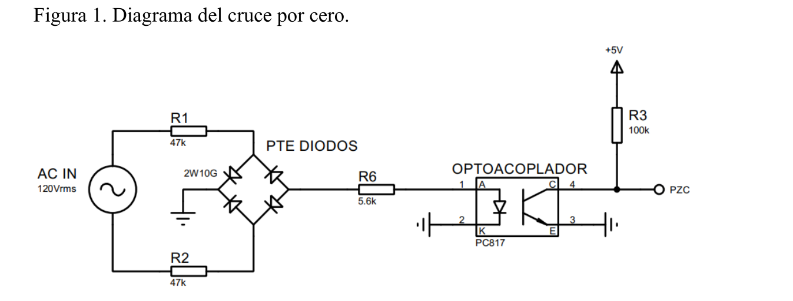
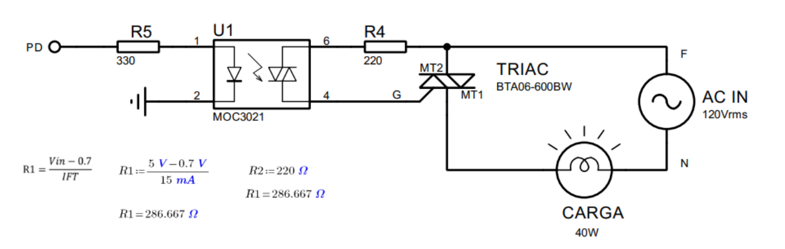
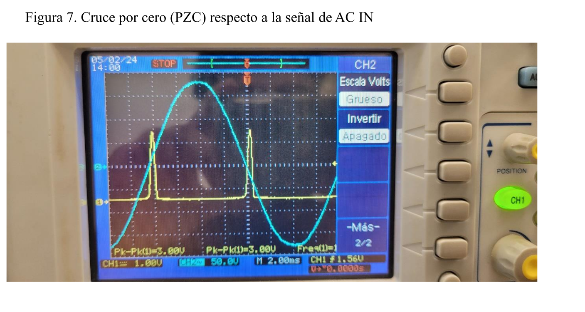
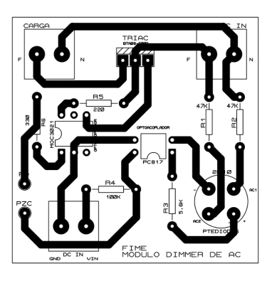
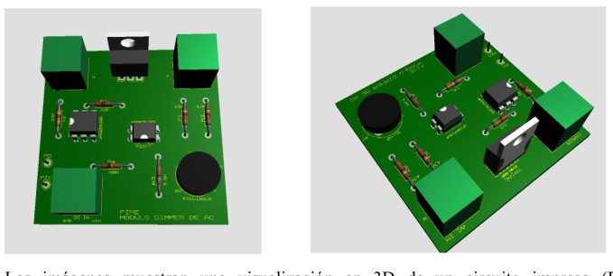
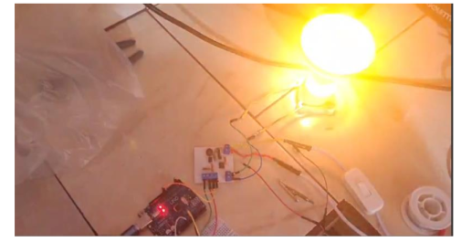
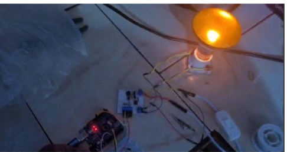

# ⚡ Phase-Synchronized Thermal Regulation System

## AC Phase-Control via Zero-Cross Detection & Discrete PI Control


---

## 📌 Overview

This project implements a **closed-loop thermal regulation system** using **phase-angle control** for AC resistive loads.  
TRIAC firing is synchronized with **mains zero-cross events**, while temperature is regulated using a **discrete-time PI controller**.

✔ Hardware validated at **127V / 60Hz**  
✔ Real-time zero-cross synchronization (120 Hz)  
✔ Deterministic discrete control loop (2 Hz)

---

## 🧠 System Architecture

### Control Strategy

- **Control Loop Frequency:** 2 Hz (Update every 0.5 s)
- **Zero-Cross Synchronization:** 120 Hz (Every half-cycle)
- **Sampling Time (Ts):** 0.5 s

The system measures temperature using an **LM35 sensor**, processes the signal through a discrete PI controller, and modulates AC power via TRIAC phase-angle control.

---

## 🔌 Hardware Architecture

### 🔹 Control & Synchronization

- **Microcontroller:** ATmega328P (Arduino platform)
- **Zero-Cross Detection:**
  - 2W10G Bridge Rectifier
  - PC817 Optocoupler
- **Interrupt:** INT0 (External interrupt)
- **Timer:** Timer1 (High-precision firing delay generation)



---

### 🔹 Power Stage

- **Opto-Driver:** MOC3021
- **Power TRIAC:** BTA06-600BW
- **Load:** 75W AC Resistive (Heating element / Incandescent lamp)



---

### 🔹 Sensor & Signal Conditioning

- **Sensor:** LM35 Linear Temperature Sensor
- **Signal Conditioning:**
  - Active filtering
  - Operational amplifier scaling
  - Full 0–5V ADC utilization (10-bit resolution)

---

## 📊 Signal Validation

Oscilloscope verification confirms correct synchronization between:

- 🔵 AC waveform
- 🟡 Zero-cross detection pulse

| Parameter | Measured Value |
|------------|---------------|
| PZC Frequency | 120.0 Hz |
| Half-cycle Period | 8.33 ms |
| PZC Vpp | 3.00 V |



---

## 🧮 Discrete PI Controller

Recursive implementation:

```
u(k) = u(k-1) + q0·e(k) + q1·e(k-1)
```

Using trapezoidal (Tustin) approximation:

```
q0 = Kp + (Ki·Ts)/2
q1 = (Ki·Ts)/2 - Kp
```

### Variables

- `e(k)` → Current error (Setpoint − Measured temperature)
- `u(k)` → Control effort (Mapped to conduction angle)

---

## 🔥 Power Modulation

The PI output is mapped to a Timer1 compare value.

TRIAC firing delay:

```
t_delay = t_half_cycle - t_conduction
```

Output saturation ensures safe operation:

```
0 ≤ CMP ≤ ICR1
```

---

## 🖥 PCB Design

The PCB integrates:

- Zero-cross detection stage
- Opto-isolated TRIAC driver
- Power switching stage

Design considerations:

- Track width for load current handling
- Isolation spacing for safety
- Noise-aware layout





---

## 📊 Results / Experimental Response Plot

The closed-loop thermal response was experimentally validated under step reference conditions.

### 🔹 Step Response Test

- Initial Temperature: Ambient (~25°C)
- Setpoint: 28°C (Short-range validation test)
- Control Mode: Discrete PI (Ts = 0.5 s)
- Load: 75W resistive heater

Observed behavior:

- Smooth temperature rise
- No sustained oscillations
- Stable steady-state regulation
- Minimal steady-state error



*Figure 1: System response under maximum conduction angle.*



*Figure 2: Experimental closed-loop temperature response near target setpoint.*

---

## 🧮 Mathematical Modeling

The thermal plant is approximated as a first-order system:

```
G(s) = K / (τs + 1)
```

Where:

- `K` → Thermal gain
- `τ` → Thermal time constant

Considering phase-angle modulation, the effective RMS power delivered to the load as a function of firing angle (α) is:

```
P(α) ≈ (Vm² / 2R) · (1/π) · (π - α + 0.5·sin(2α))
```

The discrete-time controller is derived using the Tustin transformation:

```
s ≈ (2/Ts) · (z - 1)/(z + 1)
```

Closed-loop transfer function (idealized continuous model):

```
T(s) = (Gc(s)G(s)) / (1 + Gc(s)G(s))
```

Where:

```
Gc(s) = Kp + Ki/s
```

---

## 📂 Repository Structure

```
├── firmware/
│   └── arduino/
│       └── main.ino        # PI Control + Zero-Cross ISR logic
├── docs/
│   ├── Practica7.pdf       # Experimental report
│   └── diagrama.pdf        # Block diagram
└── hardware/
    └── cadcam/             # Gerber files / PCB design
```

---

## 🚀 Key Features

- Deterministic phase-angle control
- Hardware-level synchronization
- Discrete PI digital implementation
- Interrupt-driven architecture
- Experimental hardware validation

---

## 📈 Applications

- Temperature regulation systems
- Industrial heating control
- AC power modulation
- Embedded control education
- Digital control system demonstrations

---

## 📜 License

This project is provided for academic and educational purposes.
